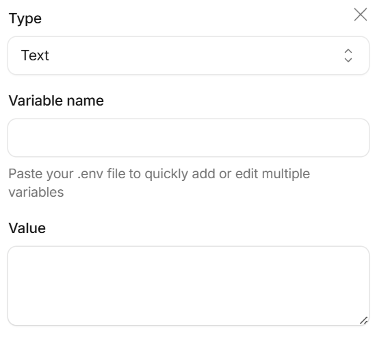

# Foreword
刚刚搭建好的Fuwari主题的Blog太简约，功能太少了？本篇文章将帮助你在你的Blog中加上自己的番剧墙，记录自己的二次元之旅并将其展现在自己的Blog上。这是我第二次分享技术，希望能够帮助到你！

作者的自言自语：拖延症什么时候能改啊，都过了半年了才憋出两个文章，还说尽量一个月更新一篇...

---
# 前言
在开始之前你可以先去[我的番剧墙](https://yaronluo.com/bangumi/)看看效果，如果觉得满意的话，那就请跟着我的步骤一步步来实现这个效果吧！
## 前置准备

### 1. 获取 Bangumi API Token

1. 访问 [Bangumi](https://bgm.tv/) 并登录你的账号
2. 记录你的用户 ID（可以在个人主页 URL 中找到，如 `bgm.tv/user/1260226` 中的 `1260226`）
3. 进入 [access-token(API Token)获取页面](https://next.bgm.tv/demo/access-token)
4. 创建一个新的个人令牌，获取 `access Token(API Token)`

### 2. 确认 Fuwari 项目已安装 Svelte

Fuwari 默认已支持 Svelte，无需额外安装。

# 操作步骤
## 步骤一：创建番剧墙页面

创建文件 `src/pages/bangumi.astro`添加：

```astro
---
import MainGridLayout from '../layouts/MainGridLayout.astro';
import BangumiPanel from '@components/BangumiPanel.svelte';

const BANGUMI_USER = import.meta.env.PUBLIC_BANGUMI_USER || "你的用户ID";
const BANGUMI_TOKEN = import.meta.env.PUBLIC_BANGUMI_TOKEN || "";

const COLLECTION_TYPES = [
    { id: 3, label: '正在心动', color: 'bg-emerald-400 dark:bg-emerald-500 text-white' },
    { id: 2, label: '完结撒花', color: 'bg-pink-400 dark:bg-pink-500 text-white' },
    { id: 1, label: '预定入坑', color: 'bg-sky-400 dark:bg-sky-500 text-white' },
    { id: 4, label: '时空凝结', color: 'bg-purple-400 dark:bg-purple-500 text-white' },
    { id: 5, label: '物理斩断', color: 'bg-neutral-400 text-white' }
];

let allCollections: any[] = [];
let statusCounts: Record<string, number> = { '3': 0, '2': 0, '1': 0, '4': 0, '5': 0 };
let errorMessage: string | null = null;
let isLoading = true;

try {
    if (!BANGUMI_TOKEN) {
        throw new Error("未配置 BANGUMI_TOKEN 环境变量");
    }

    const fetchPromises = COLLECTION_TYPES.map(async (cType) => {
        const url = `https://api.bgm.tv/v0/users/${BANGUMI_USER}/collections?subject_type=2&type=${cType.id}&limit=50`;
        const res = await fetch(url, {
            headers: {
                'User-Agent': 'Fuwari-Bangumi/1.0',
                'Authorization': `Bearer ${BANGUMI_TOKEN}`
            }
        });
        if (!res.ok) {
            const errorText = await res.text();
            throw new Error(`API 请求失败 (${res.status}): ${errorText}`);
        }
        const resData = await res.json();
        return (resData.data || []).map((item: any) => ({ ...item, type: cType.id }));
    });

    const results = await Promise.all(fetchPromises);
    allCollections = results.flat().filter((item) => item && item.subject);

    allCollections.forEach((item: any) => {
        statusCounts[String(item.type)] = (statusCounts[String(item.type)] || 0) + 1;
    });
} catch (error) {
    console.error("获取 Bangumi 数据失败:", error);
    errorMessage = error instanceof Error ? error.message : "未知错误";
} finally {
    isLoading = false;
}
---

<MainGridLayout title="番剧观测" description="我的追番记录墙">
    <div class="card-base w-full p-6 md:p-8 flex flex-col gap-6 bg-[radial-gradient(#e2e8f0_1px,transparent_1px)] dark:bg-[radial-gradient(#334155_1px,transparent_1px)] [background-size:20px_20px]">

        <div class="text-center my-2 flex flex-col gap-2">
            <h1 class="text-2xl sm:text-3xl font-black bg-gradient-to-r from-emerald-400 via-pink-400 to-orange-400 bg-clip-text text-transparent tracking-wider drop-shadow-sm">
                我的番剧墙
            </h1>
            <p class="text-neutral-500 dark:text-neutral-400 text-xs font-semibold tracking-widest bg-neutral-200/40 dark:bg-neutral-800/50 px-4 py-1 rounded-full inline-block self-center border border-neutral-200/30 dark:border-neutral-700/20">
                记录我的二次元之旅
            </p>
        </div>

        {isLoading ? (
            <div class="flex justify-center items-center py-12">
                <div class="animate-spin rounded-full h-8 w-8 border-2 border-[var(--primary)] border-t-transparent"></div>
            </div>
        ) : errorMessage ? (
            <div class="text-center py-12 px-4">
                <div class="text-red-400 text-sm font-semibold mb-2">数据加载失败</div>
                <div class="text-neutral-500 text-xs">{errorMessage}</div>
            </div>
        ) : allCollections.length === 0 ? (
            <div class="text-center py-12 text-neutral-400 text-xs tracking-widest">此处空空如也，快去捕捉新的奇迹吧 ✨</div>
        ) : (
            <>
                <div class="flex flex-nowrap overflow-x-auto whitespace-nowrap gap-1.5 p-2 bg-neutral-200/20 dark:bg-black/10 rounded-2xl border border-neutral-200/20 dark:border-neutral-700/10 shadow-inner [-ms-overflow-style:none] [scrollbar-width:none] [&::-webkit-scrollbar]:hidden">
                    <button data-status="all" class="tab-btn bg-[var(--primary)] text-white flex-shrink-0 px-3 py-1.5 text-xs rounded-xl font-bold tracking-wider transition-all duration-300 cursor-pointer shadow-sm scale-105">
                        全部明细 ✨ ({allCollections.length})
                    </button>
                    <button data-status="3" class="tab-btn bg-transparent text-neutral-600 dark:text-neutral-400 hover:bg-[var(--primary)] hover:text-white hover:scale-105 flex-shrink-0 px-3 py-1.5 text-xs rounded-xl font-bold tracking-wider transition-all duration-300 cursor-pointer">
                        正在心动 💓 ({statusCounts['3']})
                    </button>
                    <button data-status="2" class="tab-btn bg-transparent text-neutral-600 dark:text-neutral-400 hover:bg-[var(--primary)] hover:text-white hover:scale-105 flex-shrink-0 px-3 py-1.5 text-xs rounded-xl font-bold tracking-wider transition-all duration-300 cursor-pointer">
                        完结撒花 🎉 ({statusCounts['2']})
                    </button>
                    <button data-status="1" class="tab-btn bg-transparent text-neutral-600 dark:text-neutral-400 hover:bg-[var(--primary)] hover:text-white hover:scale-105 flex-shrink-0 px-3 py-1.5 text-xs rounded-xl font-bold tracking-wider transition-all duration-300 cursor-pointer">
                        预定入坑 📺 ({statusCounts['1']})
                    </button>
                    <button data-status="4" class="tab-btn bg-transparent text-neutral-600 dark:text-neutral-400 hover:bg-[var(--primary)] hover:text-white hover:scale-105 flex-shrink-0 px-3 py-1.5 text-xs rounded-xl font-bold tracking-wider transition-all duration-300 cursor-pointer">
                        时空凝结 🕰️ ({statusCounts['4']})
                    </button>
                    <button data-status="5" class="tab-btn bg-transparent text-neutral-600 dark:text-neutral-400 hover:bg-[var(--primary)] hover:text-white hover:scale-105 flex-shrink-0 px-3 py-1.5 text-xs rounded-xl font-bold tracking-wider transition-all duration-300 cursor-pointer">
                        物理斩断 💔 ({statusCounts['5']})
                    </button>
                </div>

                <div class="grid grid-cols-3 gap-4" id="bangumi-grid">
                    {allCollections.map((item: any) => {
                        const statusInfo = COLLECTION_TYPES.find(c => c.id === item.type);
                        const name = item.subject.name_cn || item.subject.name || 'Anime';
                        const score = item.subject.score ? item.subject.score.toFixed(1) : '暂无';
                        const rawImg = item.subject.images?.large || '';
                        const hasImage = !!rawImg;
                        const img = hasImage ? `https://images.weserv.nl/?url=${rawImg}` : '';
                        const statusLabel = statusInfo?.label || '未知';
                        const statusColor = statusInfo?.color || 'bg-neutral-500';

                        return (
                            <a href={`https://bgm.tv/subject/${item.subject.id}`} target="_blank" rel="noopener noreferrer"
                               class="bangumi-item block group relative aspect-[2/3] rounded-2xl overflow-hidden bg-neutral-200/50 dark:bg-neutral-800/50 shadow-sm border border-neutral-200/30 dark:border-neutral-700/30 transition-all duration-500 hover:-translate-y-1.5 hover:shadow-md hover:border-[var(--primary)]/40 cursor-pointer"
                               data-type={item.type}>
                                <span class={`absolute top-2 left-2 z-10 px-2 py-0.5 text-[9px] font-black rounded-md tracking-wider shadow-sm ${statusColor}`}>
                                    {statusLabel}
                                </span>
                                {hasImage ? (
                                    <>
                                        
                                        <div class="w-full h-full hidden items-center justify-center bg-neutral-200/50 dark:bg-neutral-800/50">
                                            <span class="text-neutral-400 text-xs">图片加载失败</span>
                                        </div>
                                    </>
                                ) : (
                                    <div class="w-full h-full flex items-center justify-center bg-neutral-200/50 dark:bg-neutral-800/50">
                                        <span class="text-neutral-400 text-xs">暂无图片</span>
                                    </div>
                                )}
                                <div class="absolute inset-0 bg-gradient-to-t from-black/95 via-black/40 to-transparent opacity-0 group-hover:opacity-100 transition-opacity duration-300 flex flex-col justify-end p-3 text-left">
                                    <h3 class="text-white text-xs font-bold line-clamp-2 mb-1 leading-snug tracking-wide">{name}</h3>
                                    <div class="flex items-center gap-1 bg-white/10 dark:bg-black/20 px-1.5 py-0.5 rounded w-fit backdrop-blur-sm border border-white/5">
                                        <svg class="w-3 h-3 text-amber-300 fill-current" viewBox="0 0 20 20"><path d="M9.049 2.927c.3-.921 1.603-.921 1.902 0l1.07 3.292a1 1 0 00.95.69h3.462c.969 0 1.371 1.24.588 1.81l-2.8 2.034a1 1 0 00-.364 1.118l1.07 3.292c.3.921-.755 1.688-1.54 1.118l-2.8-2.034a1 1 0 00-1.175 0l-2.8 2.034c-.784.57-1.838-.197-1.539-1.118l1.07-3.292a1 1 0 00-.364-1.118L2.98 8.72c-.783-.57-.38-1.81.588-1.81h3.461a1 1 0 00.951-.69l1.07-3.292z" /></svg>
                                        <span class="text-amber-300 text-[10px] font-black tracking-wider">{score}</span>
                                    </div>
                                </div>
                            </a>
                        )
                    })}
                </div>

                <div id="bangumi-pagination" class="flex justify-center items-center gap-4 mt-4">
                    <button id="btn-prev" class="px-4 py-1.5 text-xs rounded-xl font-bold tracking-wider transition-all duration-300 cursor-pointer bg-neutral-200/40 dark:bg-neutral-800/40 text-neutral-600 dark:text-neutral-400 border border-neutral-200/20 dark:border-neutral-700/20 hover:bg-[var(--primary)] hover:text-white disabled:opacity-20 disabled:cursor-not-allowed disabled:hover:bg-transparent disabled:hover:text-neutral-400 shadow-sm">
                        上一页 👈
                    </button>
                    <span id="page-indicator" class="text-xs font-black text-neutral-500 dark:text-neutral-400 tracking-widest bg-neutral-200/20 dark:bg-black/10 px-3 py-1 rounded-lg border border-neutral-200/10">
                        1 / 1
                    </span>
                    <button id="btn-next" class="px-4 py-1.5 text-xs rounded-xl font-bold tracking-wider transition-all duration-300 cursor-pointer bg-neutral-200/40 dark:bg-neutral-800/40 text-neutral-600 dark:text-neutral-400 border border-neutral-200/20 dark:border-neutral-700/20 hover:bg-[var(--primary)] hover:text-white disabled:opacity-20 disabled:cursor-not-allowed disabled:hover:bg-transparent disabled:hover:text-neutral-400 shadow-sm">
                        下一页 👉
                    </button>
                </div>

                <BangumiPanel client:load />
            </>
        )}

    </div>
</MainGridLayout>
```
> [!IMPORTANT]
> 代码中的你的用户ID要改成自己的！！！
## 步骤二：创建交互组件

创建文件 `src/components/BangumiPanel.svelte`添加：

```svelte
<script lang="ts">
	import { onMount } from "svelte";

	let grid: HTMLElement | null = null;
	let items: NodeListOf<HTMLElement> | null = null;
	let tabs: NodeListOf<HTMLElement> | null = null;
	let prevBtn: HTMLElement | null = null;
	let nextBtn: HTMLElement | null = null;
	let indicator: HTMLElement | null = null;
	let paginationBar: HTMLElement | null = null;

	const ITEMS_PER_PAGE = 9;
	let currentStatus = 'all';
	let currentPage = 1;
	let totalPages = 1;

	// 事件监听器引用，用于清理
	const eventListeners: Array<() => void> = [];

	function render() {
		if (!items || !items.length) {
			// 当没有项目时，隐藏分页栏
			if (paginationBar) {
				paginationBar.style.display = 'none';
			}
			return;
		}

		const visibleItems: HTMLElement[] = [];

		// 1. 分类隐藏
		items.forEach(item => {
			if (currentStatus === 'all' || item.dataset.type === currentStatus) {
				visibleItems.push(item);
			} else {
				item.style.display = 'none';
			}
		});

		// 2. 边界约束计算
		totalPages = Math.ceil(visibleItems.length / ITEMS_PER_PAGE) || 1;
		if (currentPage > totalPages) currentPage = totalPages;
		if (currentPage < 1) currentPage = 1;

		const start = (currentPage - 1) * ITEMS_PER_PAGE;
		const end = start + ITEMS_PER_PAGE;

		// 3. 严格分拨 3x3 页面可见元素
		visibleItems.forEach((el, index) => {
			if (index >= start && index < end) {
				el.style.display = 'block';
			} else {
				el.style.display = 'none';
			}
		});

		// 4. 控制栏同步
		if (prevBtn) prevBtn.disabled = (currentPage === 1);
		if (nextBtn) nextBtn.disabled = (currentPage === totalPages);
		if (indicator) indicator.textContent = `${currentPage} / ${totalPages}`;
		if (paginationBar) {
			paginationBar.style.display = totalPages <= 1 ? 'none' : 'flex';
		}
	}

	function handleTabClick(e: Event) {
		const target = e.currentTarget as HTMLElement;
		currentStatus = target.dataset.status || 'all';
		currentPage = 1;

		if (tabs) {
			tabs.forEach(t => {
				t.className = "tab-btn bg-transparent text-neutral-600 dark:text-neutral-400 hover:bg-[var(--primary)] hover:text-white hover:scale-105 flex-shrink-0 px-3 py-1.5 text-xs rounded-xl font-bold tracking-wider transition-all duration-300 cursor-pointer";
			});
		}
		target.className = "tab-btn bg-[var(--primary)] text-white flex-shrink-0 px-3 py-1.5 text-xs rounded-xl font-bold tracking-wider transition-all duration-300 cursor-pointer shadow-sm scale-105";

		render();
	}

	function handlePrevClick() {
		if (currentPage > 1) {
			currentPage--;
			render();
			grid?.scrollIntoView({ behavior: 'smooth', block: 'nearest' });
		}
	}

	function handleNextClick() {
		if (currentPage < totalPages) {
			currentPage++;
			render();
			grid?.scrollIntoView({ behavior: 'smooth', block: 'nearest' });
		}
	}

	onMount(() => {
		grid = document.getElementById('bangumi-grid');
		items = document.querySelectorAll('.bangumi-item');
		tabs = document.querySelectorAll('.tab-btn');
		prevBtn = document.getElementById('btn-prev');
		nextBtn = document.getElementById('btn-next');
		indicator = document.getElementById('page-indicator');
		paginationBar = document.getElementById('bangumi-pagination');

		if (!grid) {
			console.error('[BangumiPanel] 未找到 #bangumi-grid 元素');
			return;
		}

		if (!items || !items.length) {
			console.warn('[BangumiPanel] 未找到 .bangumi-item 元素');
			return;
		}

		// 绑定事件
		if (tabs) {
			tabs.forEach(tab => {
				tab.addEventListener('click', handleTabClick);
				eventListeners.push(() => tab.removeEventListener('click', handleTabClick));
			});
		}

		if (prevBtn) {
			prevBtn.addEventListener('click', handlePrevClick);
			eventListeners.push(() => prevBtn.removeEventListener('click', handlePrevClick));
		}

		if (nextBtn) {
			nextBtn.addEventListener('click', handleNextClick);
			eventListeners.push(() => nextBtn.removeEventListener('click', handleNextClick));
		}

		render();

		// 清理函数
		return () => {
			eventListeners.forEach(cleanup => cleanup());
			eventListeners.length = 0;
		};
	});
</script>
```

## 步骤三：配置环境变量
### 本地操作
直接在主目录创建 `.env` 文件（已在 `.gitignore` 中，不会提交到 git）添加：

```ini
PUBLIC_BANGUMI_USER=你的用户ID
PUBLIC_BANGUMI_TOKEN=你的API_Token
```

### 生产环境（Cloudflare）

1. 进入 [Cloudflare控制面板(Dashboard)](https://dash.cloudflare.com/) → Workers & Pages → 你的项目
2. 点击 **设置(Settings)** → **变量和密钥(Variables and secrets)**
3. 添加以下变量(其它内容保持默认)：

| 变量名                    | 值           |
| ---------------------- | ----------- |
| `PUBLIC_BANGUMI_USER`  | 你的用户ID      |
| `PUBLIC_BANGUMI_TOKEN` | 你的API_Token |

## 步骤四：添加导航链接

编辑 `src/config.ts`，在 `navBarConfig.links` 中：

```typescript
export const navBarConfig: NavBarConfig = {
    links: [
        LinkPreset.Home,
        LinkPreset.Archive,
        LinkPreset.Series,
        { name: "番剧观测", url: "/bangumi/" },  // 添加这一行
        LinkPreset.About,
    ],
};
```

## 步骤五：查看你的番剧墙

先在终端输入`pnpm dev`本地预览你的番剧墙

如果没有问题的话git到你的网站上

输入命令`git add .`添加所有更改

输入命令`git commit -m "你的提交信息"`提交更改，其中**你的提交信息**可以更改

输入命令`git push`推送更改你的更改到Github

## 步骤六：定时同步（可选）

因为番剧墙是静态页面，当你在Bangumi上更新自己的番剧数据时候，页面不会自动更新，所以使用 Cloudflare Pages，可以设置定时自动更新：

1. 主目录创建 `.github/workflows/bangumi-sync.yml`：

```yaml
name: 自动同步追番数据

on:
  schedule:
    # 每天北京时间凌晨 4 点自动执行 (UTC 时间 20:00)
    - cron: '0 20 * * *'
  workflow_dispatch:  # 允许手动触发

jobs:
  trigger-build:
    runs-on: ubuntu-latest
    steps:
      - name: 触发 Cloudflare Pages 构建
        run: |
          curl -X POST "https://api.cloudflare.com/client/v4/pages/webhooks/deploy_hooks/你的WebhookURL"
```

2. 在  [Cloudflare控制面板(Dashboard)](https://dash.cloudflare.com/) 获取 Webhook URL：
   - 进入你的 Pages 项目
   - 点击 **设置(Settings)** → **部署挂钩(Deploy hooks)** → **生成一个新的挂钩**
   - **复制生成的 URL 并替换到上面的 YAML 文件中**(就是上面代码冒号里面内容全部替换为你的)

# 关于这个番剧墙
## 功能说明

- **分类筛选**：支持按观看状态筛选（正在心动、完结撒花、预定入坑等）
- **分页显示**：每页显示 9 个番剧，支持翻页
- **悬停效果**：鼠标悬停显示番剧名称和评分
- **图片处理**：支持图片加载失败降级显示
- **响应式设计**：适配移动端和桌面端

## 自定义

你可以根据需要修改以下内容：

- **分类标签**：修改 `COLLECTION_TYPES` 数组中的标签名称和颜色
- **每页数量**：修改 `BangumiPanel.svelte` 中的 `ITEMS_PER_PAGE` 常量
- **页面标题**：修改 `bangumi.astro` 中的标题和描述
- **样式**：修改 Tailwind CSS 类来自定义外观

## 故障排查

### 数据加载失败

1. 检查环境变量是否正确配置
2. 检查 API Token 是否有效
3. 查看浏览器控制台的错误信息

### 样式异常

1. 确保使用了 Fuwari 主题的 CSS 变量
2. 检查 Tailwind CSS 类是否正确

# 最后
相信你已经成功在自己的Blog上弄好了自己的番剧墙，感谢你的浏览！我会继续分享更多技术教程的，如果看完这个文章你仍然不懂，或者我的文章有误，你可以通过社交媒体联系我

***今天就这样吧，希望下次你还在这里！***