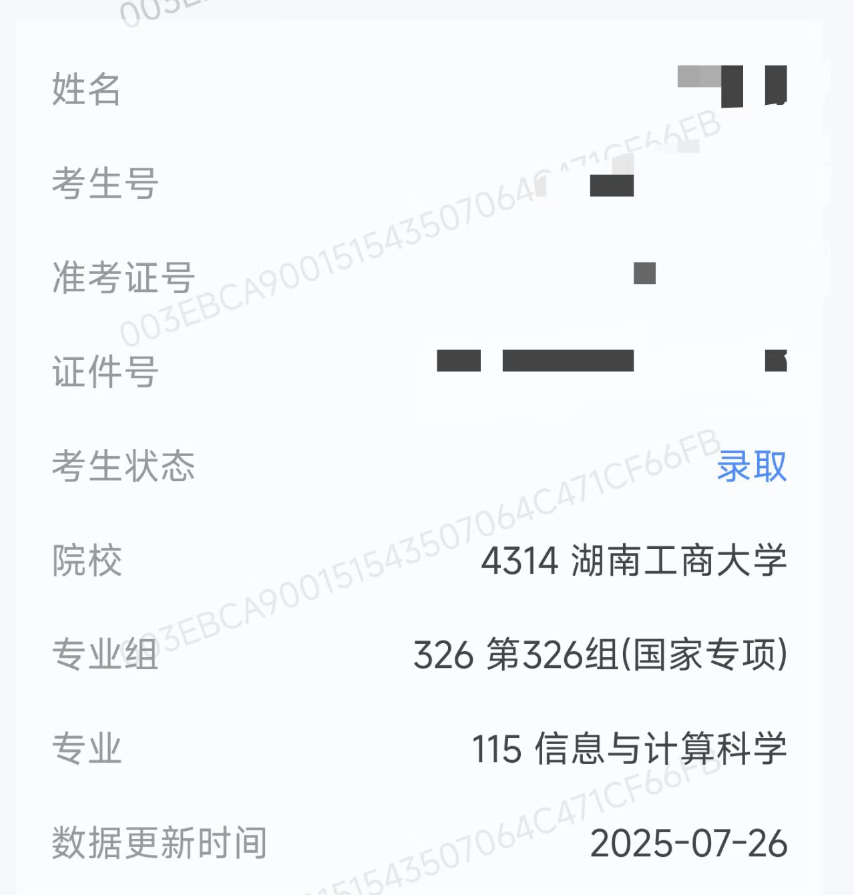
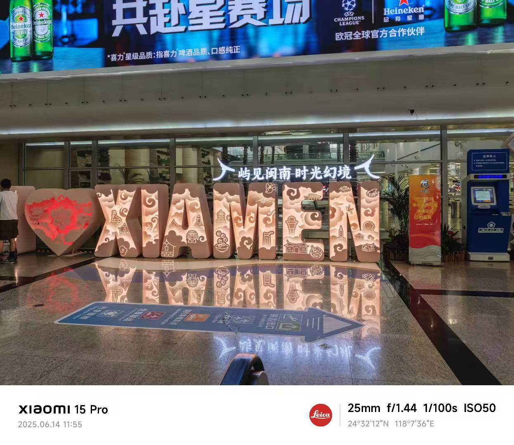
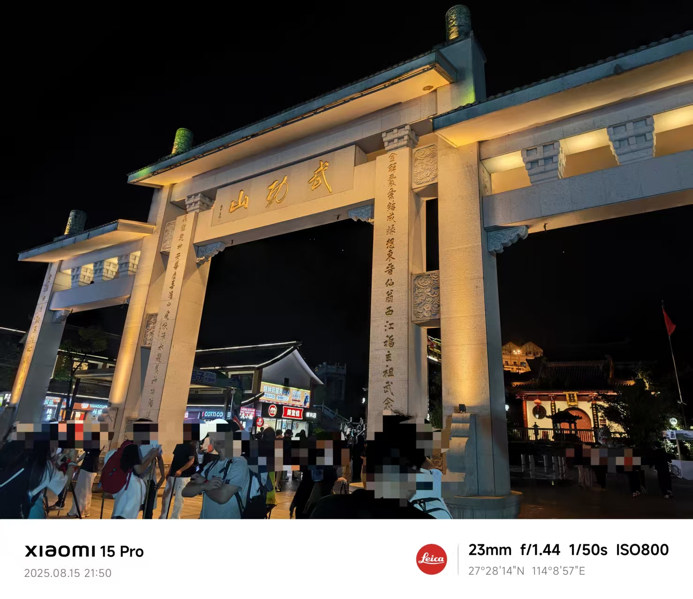
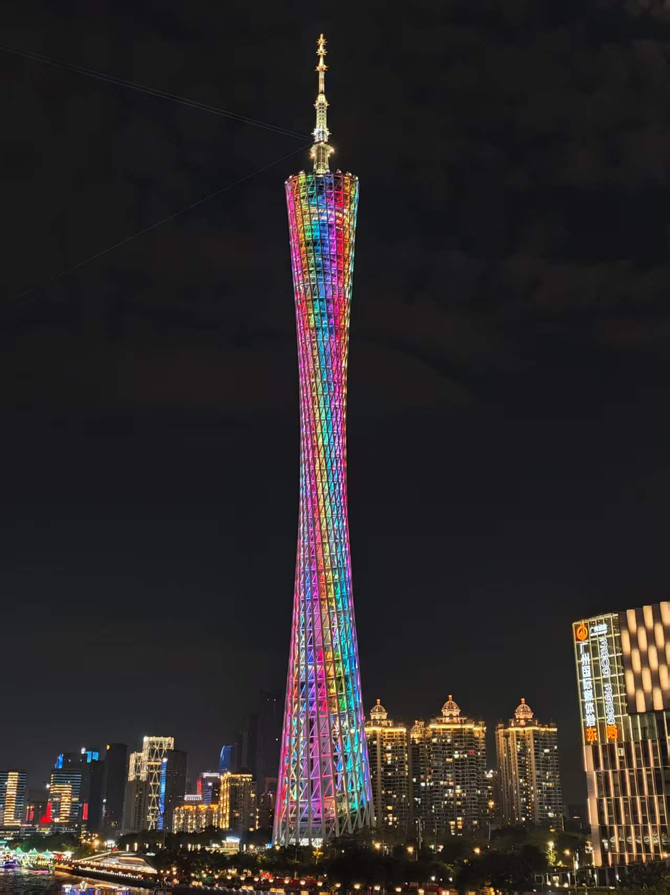
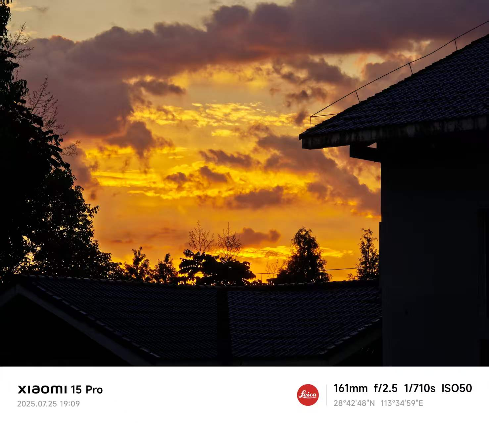

# Foreword
距离上次更新Blog已经快过去整整三个月了，寒假在家本来是想要更新的，但是太懒了不想写，于是便拖到了开学才来写，那么这篇Blog就是我的2026第一篇Blog啦！
# Bye-2025
在中国我们除了公历新年以外，还有农历新年，春节可以说是中国人最看重的节日，所以首先祝正在观看这篇Blog的各位`马年快乐`！

**2025是学业有成的一年**！这一年我经历了人生的一大重要转折点高考，虽然考试的成绩并不是特别的拔尖，但对于我来说已经足够了。小学我的成绩平平无奇，甚至可以说很差劲，以至于初中就不被看好，但最终我还是凭借自己的努力成功考上了普高，并且在今年考上了我省的一本大学！而且目前我已经通过自己的努力成功转专业到了计算机专业。

**2025是成长的一年**！25年的11月份我满18岁了，生日年年都有，唯独18岁的生日意义非凡，这标志着我彻底的成长了，不再是一个小孩子了，而是成为了一个成年人。18年以来我从未离开过父母去生活，步入了大学的我第一次离开了父母去生活，刚开始会感觉到不适应，但是现在我已经能够接受了，这也许也是一种成长吧哈哈哈！

**2025是充满活力的一年**！高考完以后我和一群高中的同学们开始了毕业旅行，从来没有坐过飞机的我第一次坐上了飞机，就像刘姥姥进大观园一样兴奋哈哈！！拍下了我的第一张飞机照。除此之外今年我还坐上了轮船和高铁！

在今年我去了很多的地方，从小就喜欢大海的我来到了厦门！(详细请看[Travel Diary ---厦门 - Yaron's Life](https://yaronluo.com/posts/travel-diary---%E5%8E%A6%E9%97%A8/)）

因为想见日出云海，我来到了武功山！(但是最终还是没有见到日出云海，因为雾太大了）

在假期的最后一段时间我来到了广州，见到了广州塔！

兜兜转转最后我回到了家乡，我的家乡也是十分美丽的一个地方！在这我见到了火烧云！

**2025是番剧和音乐环绕的一年**！这一年我的歌单又收藏了许多好听的歌曲！除了往年的周杰伦和邓紫棋之外，今年新添加了孙燕姿，许嵩，梁静茹等歌星！

并且我还发现了一首特别好听的日文歌：因为我喜欢你，歌手ユイカ比较小众，但是这首歌十分好听！歌词写的特别的好，大家感兴趣的话可以去看看！
<iframe frameborder="no" border="0" marginwidth="0" marginheight="0" width=400 height=80 src="https://i.y.qq.com/n2/m/outchain/player/index.html?songid=332395876&songtype=0
"></iframe>

在番剧上，我喜欢看甜甜的恋爱番，首先我看了：擅长捉弄的高木同学，看了整整两遍，这部番剧在我心中纯爱番排第一，以至于我一直想什么时候我会遇到我的那个高木同学啊哈哈！此外高桥李依唱的小小恋歌真的好好听啊！！！
<iframe frameborder="no" border="0" marginwidth="0" marginheight="0" width=400 height=80 src="https://i.y.qq.com/n2/m/outchain/player/index.html?songid=213432703&songtype=0
"></iframe>

我还看了：辉夜大小姐想让我告白，也是非常的好看！不仅仅是甜甜的恋爱，也充满了喜剧！

# Hi–2026
小时候总觉得一年365天好长啊，现在感觉2025还是昨天，而今天确已经是2026了，今年的春节我感觉也是过的特别的快，一瞬间就溜走了。随着时间变化的还有我的年龄，去年17今年18，尽管如此我的一生还很长，还充满希望，望我能够在这一年做的更好吧！

希望自己学业有成，万事顺利

六月份四级顺利通过(去年四级没考过)

顺利拿到驾照

父母正在慢慢变老

希望他们健健康康

希望哥哥的工作和爱情一切顺利

也希望今年能找到一个女朋友哈哈(这个不是必须的)

今年美加墨世界杯葡萄牙夺冠

圆C罗一个梦

也圆满我自己的青春

# Last but not least
再见，2025！

你好，2026！

望新的一年你我都越来越好，每一天都充满阳光和希望！

星光不问赶路人，愿时光不负有心人！

***今天就这样吧，希望下次你还在这里！***

