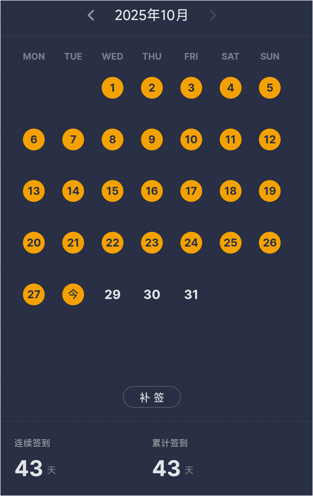

# Foreword
其实这也不是我第一次写博客了，第一次接触Blog是2023年5月份，那时候没有电脑，还在读高二，但我还是用手机买了云服务器和域名，跟着网上的教程一步步建立起了我的第一个Blog，用的wordpress，但没过多久我就放弃了继续写，因为我想要的是技术Blog，但是我后面发现其实我的技术也不太行，所以我便失去了目标，觉得写Blog也挺没意思的。

现在我大一又重新开始了写Blog因为我找到了目标，我可以在Blog上分享我的生活啊(当然顺便再分享点技术吧)，就这样我写下了我这个Blog的第一篇帖子。即使我想过也许不会有人看，但是我相信这个能给未来的我留下一个美好的回忆！

# In the past few days

## 学习上
忙于学习，例如：学习C语言，数分，高代。说到学习其实有一个我还是蛮骄傲的就是我的不背单词，从9月份开始记单词到现在没有中断过一次，并不是我有多牛的毅力(要是真有这种毅力我就上985了哈哈哈)，主要是要考四级考试，想大一就尽量过掉，拖久了我就忘记单词了。。。

## 生活上
大一的生活挺无聊的，对于我来说每天都挺多事的，报了一个C语言集训营，想要大一上就学完C语言(最近欠了挺多的课程因为创建Blog)，每天过的像机器人，记单词，学习，刷视频反反复复的。

即使现在大一了，但是我与高中同学仍然还保持联系！一直认为高中毕业就和初中，小学一样，几乎不会再有联系，现在看来只是我们不愿意聊天罢了。希望我们同学情谊可以继续保持下去！

说到建立Blog我还是挺恼火的，弄了我很长时间，因为这次我不是wordpress建立的，用的nodejs+pnpm，没有wordpress那样搭建的简单，网上的教程也残次不齐，浪费了我许多时间，那么我为啥不继续用wordpress呢？因为想省钱，用wordpress就得买云服务器，所以我没选择wordpress，此外我还想学习这种建站方法，下次有时间我出一个教程，避免踩坑，时间就是生命！！！

# Last but not least
 这周还有一个特别的日子，就是我18岁生日，可能也是我第一次离开父母独自生日！
 **无论多苦多累，都不要忘记自己的生日哦！**

今天就这样吧，希望下次你还在这里！
