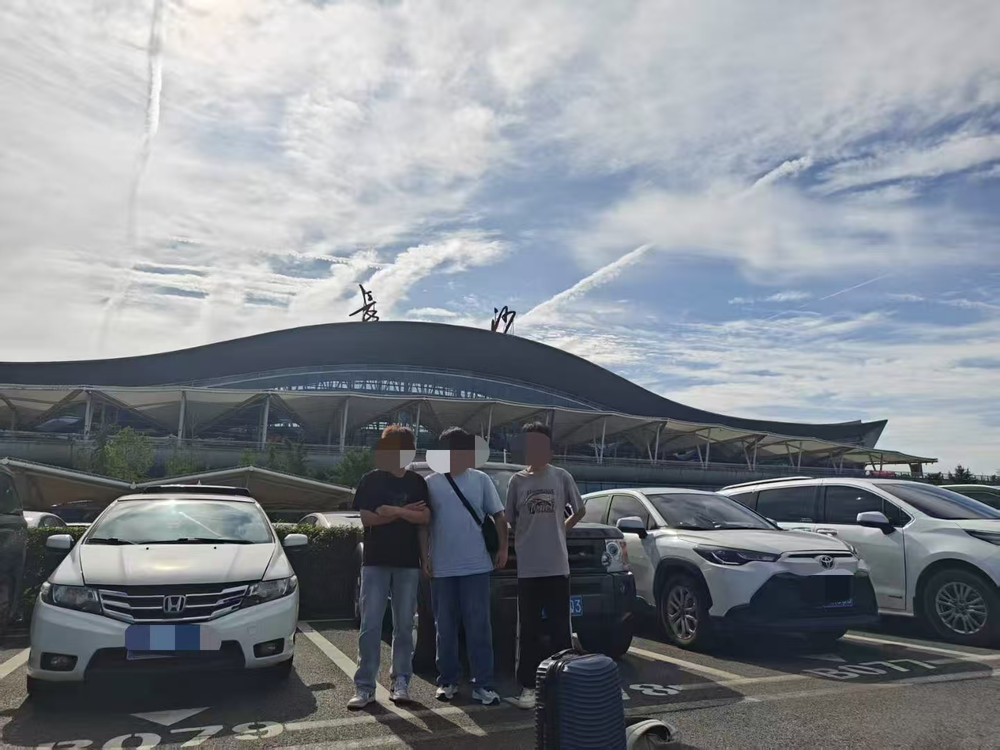

# Foreword
今天又来写Blog了，趁现在有时间有兴趣多写一点Blog，说不准后面我就没有兴趣更新Blog了哈哈哈哈哈哈哈。

`开一个新的方向写一下我的旅行分享吧！`

高考还没有毕业的时候我就开始计划毕业旅行了，对于出生在内陆的我，从小就对大海有着憧憬，特别是23年的一件事加深了我对大海的向往。

趁现在大海还没有被污染，看看海吧！

`人的一生一定要看一次大海`

梵高作品：海景

就这样拉人出发！！！

# 旅途
## 2025 6.14
上午我们来到了长沙黄花国际机场，三个帅哥合照(其实有四个人还有个没到)

第一次坐plane(像一个没见过世面的人一样对着飞机到处拍)

不到中午12点我们就到达厦门

来到厦门一定要尝尝特色美食**沙茶面**，湖南伢子表示不辣受不了

景色真的好美哦！

## 2025 6.15
睡去第一天的疲惫，第二天从靠海的房间(民宿)中醒来，真是惬意啊！
既然来厦门是看海的那就一起来看海吧！

原来大海是这样的，原来沙滩是这样的！美哦~~

## 2025 6.16
这是我老哥去厦门时拍的照片，10年了应该，而它就在鼓浪屿上。

所以来厦门怎么能不去鼓浪屿呢？顺便看看我哥拍的这个店还在不在。

鼓浪屿上也是特别好看，只是没有代步工具，所有地方都得一步步走过去。

# Summary
厦门真的是一个特别美丽的城市！
你能在鼓浪屿上见到许多具有历史意义的建筑，感慨岁月的变迁。
你能在厦门环岛路上骑行，沐浴在海风的吹拂下，近处沙滩、远处的海水以及日出日落映衬着的那片海景让人难以挪步。
你能在白城沙滩上看到美丽的日出。
此外厦门还有集美学村，海上地铁，黄厝海滩，十里长堤等许多美丽的地方，好吃的当地美食等等，篇幅有限就不继续写了，其实就是快凌晨了，要睡觉了。

# Lastly
我想引用歌德说过的一句话来结束这篇旅行Blog。

`“人之所以爱旅行，不是为了抵达目的地，而是为了享受旅途中的种种乐趣“。`

***今天就这样吧，希望下次你还在这里！***