# Foreword
这是我Blog中分享的第一个技术类的帖子，想到我搭建这个Blog踩了许多的坑，所以我写下这个帖子来一步步教会你如何搭建一个和博主一样的个人Blog，只要你愿意跟着我的教程一步步走，可以说轻松拿捏！那么现在让我们开始吧！**(注意有些太简单的操作需自行网上查找)**

---

# 介绍
本帖子所教学的是在github上开源的Fuwari([使用Astro](https://astro.build/)和[Tailwind CSS](https://tailwindcss.com/)构建)主题的静态博客，并且我们还需要通过Cloudflare Pages来托管我们的静态网站。

[Fuwari主题github开源地址](https://github.com/saicaca/fuwari)

[Fuwari演示站点](https://fuwari.vercel.app/)

[Cloudflare网址](https://www.cloudflare.com/zh-cn/)

# 一、准备工作
1. 一个github账号(gitHub是一个基于Git版本控制系统的代码托管平台)
2. 一个Cloudflare账号(Cloudflare主要提供内容分发网络（CDN）、网络安全、DDoS防护和域名服务等。)
3. 一个域名
4. 安装Node.js和npm
5. Git(可以将我们所做的更改发布到Github仓库)

   `以上只有第三个需要购买，其余皆为免费`

# 二、Blog原理介绍
本地部署Fuwari，编写好文章和所做的修改>通过Git推送更改到远程的Github仓库>Cloudflare Pages检测到远程Github仓库被修改然后自动构建新的静态网站文件>随后网站成功修改

# 三、让我们开始吧！
## 1.创建github账号并且拉取Fuwari仓库
**1.打开[GitHub](https://github.com/)网站注册，Github不支持中文，请自行用浏览器翻译注册！如果打不开网站，请开启VPN(翻墙)访问！**
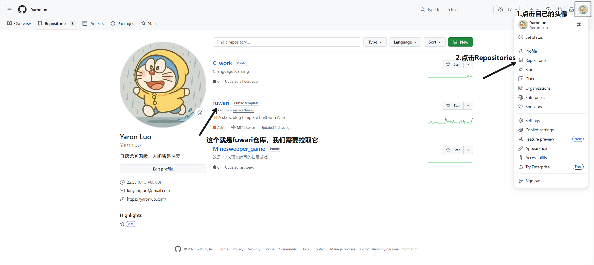

**2.开始拉取Fuwari仓库[Fuwari仓库地址](https://github.com/saicaca/fuwari)**
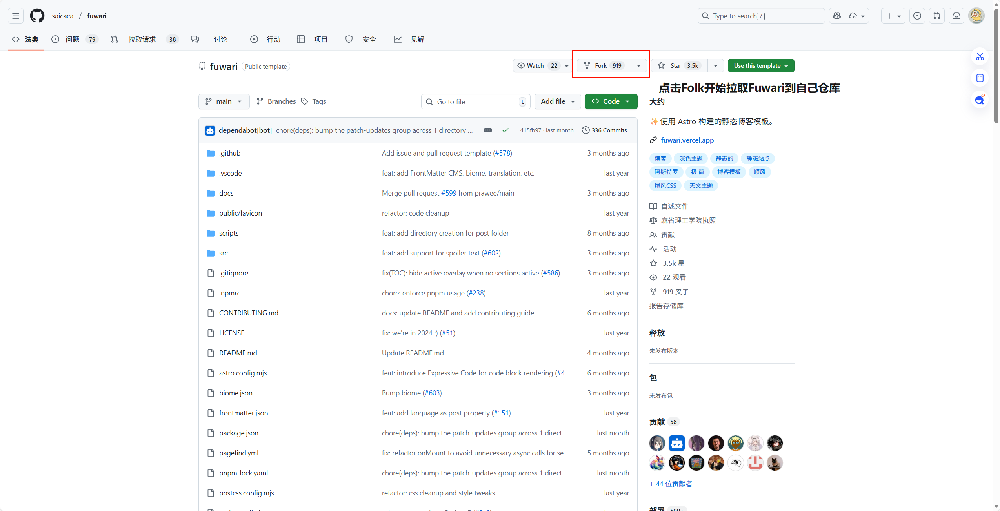

请按照下图来拉取Fuwari
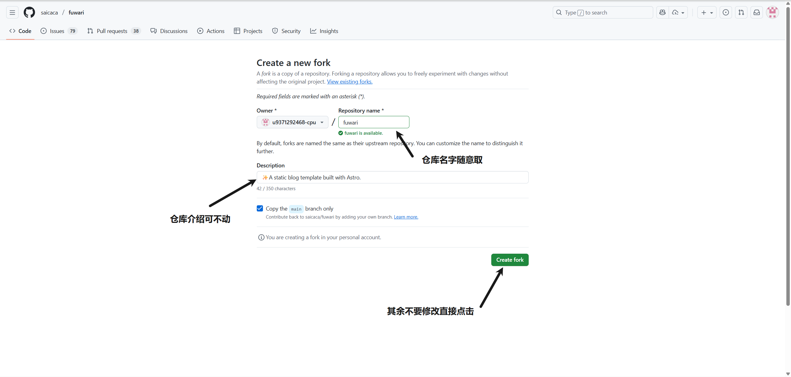

完成以上所有操作后再次按照上面第一张图片操作，便能看到你的仓库中已经有了Fuwari仓库。

## 2.安装Node.js和npm并将Fuwari本地部署
**1.安装Node.js和npm**[Node.js下载地址](https://nodejs.org/zh-cn/download)
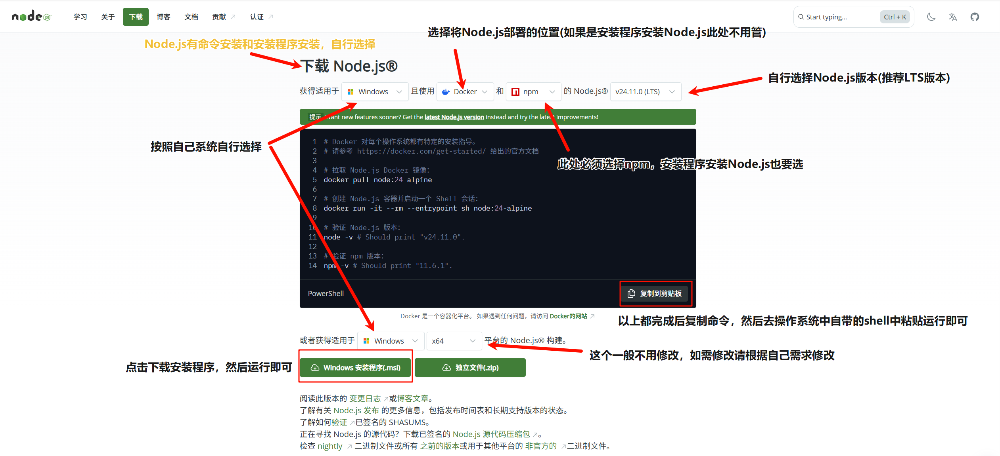

命令安装教程(windows)


安装程序安装教程(所有均保持默认除非你知道自己在干什么，否则一直点击next直到install)
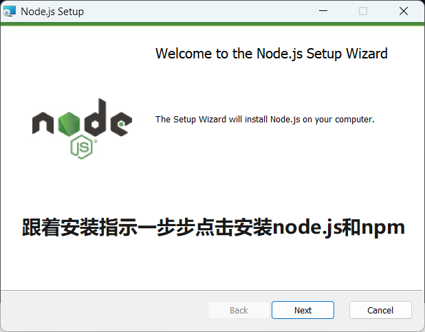

**验证是否安装成功**

回到你的系统的shell中(windows为powershell)

输入以下命令运行
```
   node -v
   npm -v
```
如果显示版本号，说明安装成功。

**如果报错**请按`Win + R`，输入`cmd`，打开命令提示符后在里面再次输入以上命令验证！
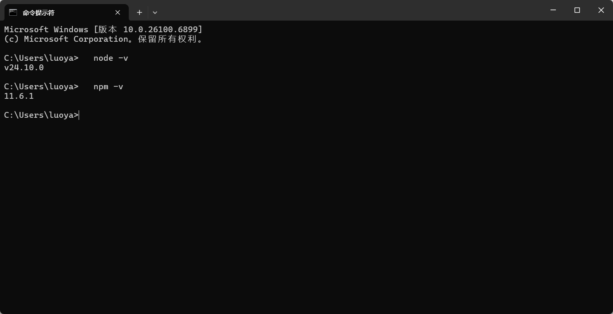

**2.安装Git**[安装链接](https://git-scm.com/install/windows)


安装完下载程序后双击打开然后一路默认即可，出现这个界面安装就完成了！
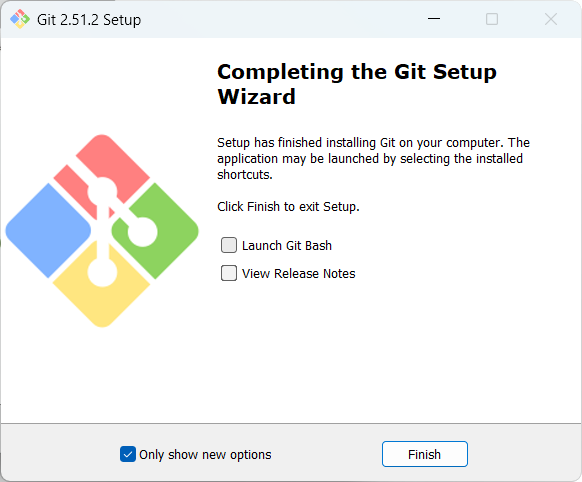

如果不放心可以命令检测，仍然按`Win + R`，输入`cmd`粘贴以下代码运行
```
git --version
```
出现版本号，说明安装成功


**3.将你前面拉取到自己仓库的Fuwari仓库克隆到本地(ssh法可以不用VPN来推送)**

windows打开powershell(不是命令提示符)，其余系统用自带的shell程序

生成ssh密钥
```
   ssh-keygen -t rsa -C "填写你注册GitHub时用的邮箱"
```
然后终端会提示

*确认密钥*保存路径`Enter file in which to save the key (C:\xxx\xxx\.ssh/id_rsa):`直接回车，使用默认路径 `C:\xxx\xxx\.ssh/id_rsa`

*设置密码*(可选)`Enter passphrase (empty for no passphrase):`直接回车，不设置密码更方便
  
生成完成后用以下命令来复制公钥(不会自动复制公钥)
```
  cat ~/.ssh/id_rsa.pub
```
手动复制公钥以 `ssh-rsa` 开头，全部复制

然后打开[Github添加公钥](https://github.com/settings/keys)
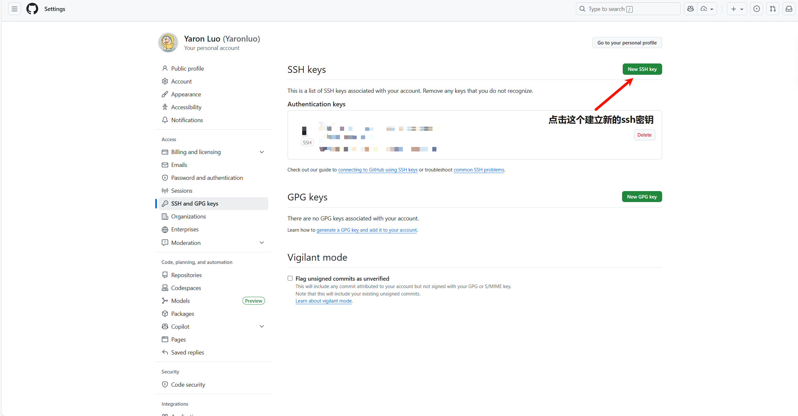


回到你的仓库页面，打开已经拉取到了你仓库里的fuwari仓库，按照以下操作
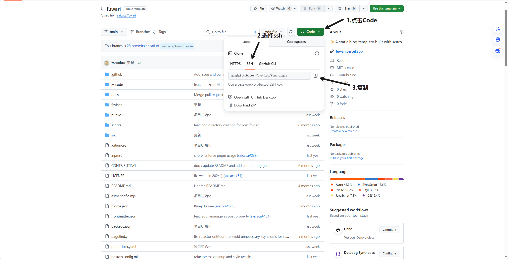

继续打开powershell，
```
    git clone git@github.com:Yaronluo/fuwari.git
```
以上的`git@github.com:Yaronluo/fuwari.git`更换为自己刚刚粘贴的链接

然后将修改完的以上代码粘贴到powershell中回车运行

安装完成后再全局安装pnpm
```
npm install -g pnpm
```
然后再安装依赖(两个都要)
```
pnpm install
```
```
pnpm add sharp
```
以上安装命令均在powershell中运行，并且请一次安装一个

**到此，你成功在本地部署了Fuwari仓库**

> [!TIP] 
> 由于拉取的fuwari仓库无法将可见性设置为私密，
> 
> 因此你可以使用创建一个新的空仓库然后手动上传你拉取的fuwari仓库中的文件，
> 
> 这样就可以将可见性改为私密，关于如何修改可见性请自行搜索教程

现在你应该能在电脑文件里找到fuwari文件夹


> [!IMPORTANT]
> 注意这里文件夹名称不一定是fuwari，是你前文所拉取fuwari仓库的时候改的名称，如果没改默认就是fuwari，下文所指的所有fuwari文件夹皆是如此

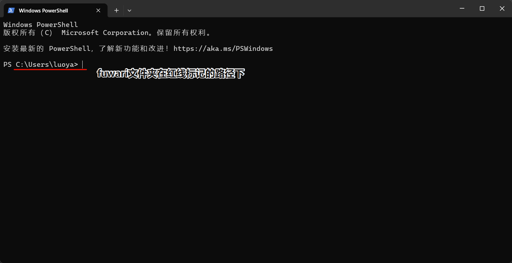

## 3.改写你的Fuwari
> 刚创建的Fuwari和演示网站一模一样，我们需要改写它，使它真正成为你的Blog

**1.打开你的`fuwari`文件找到路径`src/config.ts`然后开始更改**
- title：你的Blog主标题
- subtitle：你的Blog副标题
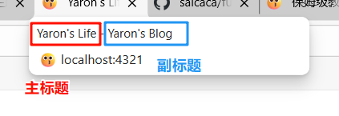

- lang：Blog的显示语言，注释已经给出了常见语言的代码，更改即可
- themeColor：Blog的主题色，其中fixed的false改为true就可以隐藏Blog的颜色选择，hue是颜色代码
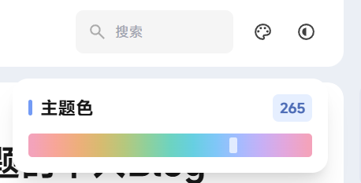
- banner：Blog的背景图默认关闭，src：即背景图，支持http/https URL
- favicon：Blog网站图标，src：即网站图标，支持http/https URL
- links(`NavBarConfig`)：是导航栏的链接
- avatar：你的头像
- name：你的名字
- bio：个性签名显示在头像和名字的下面
- links(`ProfileConfig`)：是头像和名字下的链接

- icon：你也许想要更改图标，那么你可以去[Iconify](https://icon-sets.iconify.design/)找到你所需的图标，fuwari默认支持`fa6-brands`, `fa6-regular`, `fa6-solid`, `material-symbols`几种类型，如下图
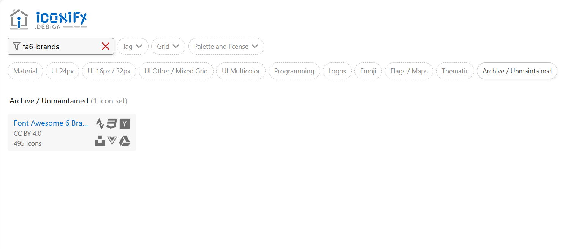
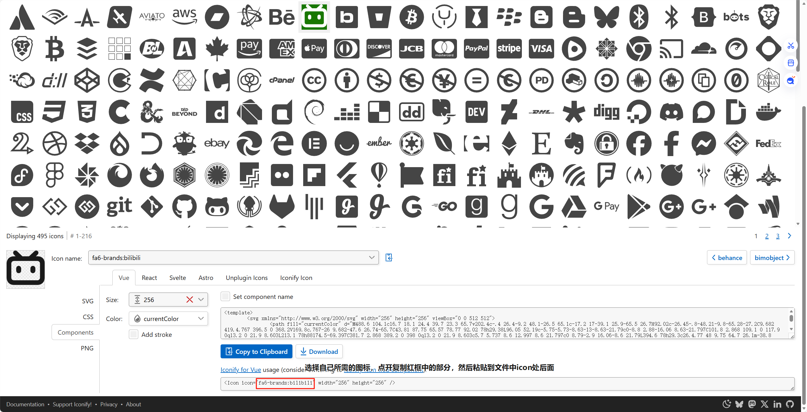
这里给上我的`config.ts`可以对照我的代码来修改
```
import type {  
    ExpressiveCodeConfig,  
    LicenseConfig,  
    NavBarConfig,  
    ProfileConfig,  
    SiteConfig,  
} from "./types/config";  
import { LinkPreset } from "./types/config";  
  
export const siteConfig: SiteConfig = {  
    title: "Yaron's Life",  
    subtitle: "Yaron's Blog",  
    lang: "zh_CN", // Language code, e.g. 'en', 'zh_CN', 'ja', etc.  
    themeColor: {  
       hue: 265, // Default hue for the theme color, from 0 to 360. e.g. red: 0, teal: 200, cyan: 250, pink: 345  
       fixed: true, // Hide the theme color picker for visitors  
    },  
    banner: {  
       enable: false,  
       src: "assets/images/demo-banner.png", // Relative to the /src directory. Relative to the /public directory if it starts with '/'  
       position: "center", // Equivalent to object-position, only supports 'top', 'center', 'bottom'. 'center' by default  
       credit: {  
          enable: false, // Display the credit text of the banner image  
          text: "", // Credit text to be displayed  
          url: "", // (Optional) URL link to the original artwork or artist's page  
       },  
    },  
    toc: {  
       enable: true, // Display the table of contents on the right side of the post  
       depth: 2, // Maximum heading depth to show in the table, from 1 to 3  
    },  
    favicon: [  
       // Leave this array empty to use the default favicon  
        {  
          src: '/favicon/favicon.png', // Path of the favicon, relative to the /public directory  
          theme: 'light',              // (Optional) Either 'light' or 'dark', set only if you have different favicons for light and dark mode  
          sizes: '32x32',              // (Optional) Size of the favicon, set only if you have favicons of different sizes  
        }  
    ],  
};  
  
export const navBarConfig: NavBarConfig = {  
    links: [  
       LinkPreset.Home,  
       LinkPreset.Archive,  
       LinkPreset.Series,  
        { name: "网站统计", url: "/stats" },  
        LinkPreset.About,  
       //{  
          //name: "GitHub",          //url: "https://github.com/saicaca/fuwari", // Internal links should not include the base path, as it is automatically added          //external: true, // Show an external link icon and will open in a new tab       //},    ],  
};  
  
export const profileConfig: ProfileConfig = {  
    avatar: "assets/images/avatar2.webp", // Relative to the /src directory. Relative to the /public directory if it starts with '/'  
    name: "Yaron",  
    bio: "日落尤其温暖，人间皆是热爱",  
    links: [  
       //{  
          //name: "Twitter",          //icon: "fa6-brands:twitter", // Visit https://icones.js.org/ for icon codes          // You will need to install the corresponding icon set if it's not already included          // `pnpm add @iconify-json/<icon-set-name>`          //url: "https://twitter.com",       //},       //{          //name: "Steam",          //icon: "fa6-brands:steam",          //url: "https://store.steampowered.com",       //},       {  
          name: "GitHub",  
          icon: "fa6-brands:github",  
          url: "https://github.com/Yaronluo",  
       },  
        {  
            name: 'QQ',  
            icon: 'fa6-brands:qq',  
            url: 'https://qm.qq.com/q/2jKJhKcCjm',  
        },  
        {  
            name: 'Bilibili',  
            icon: 'fa6-brands:bilibili',  
            url: 'https://space.bilibili.com/321153856',  
        },  
    ],  
};  
  
export const licenseConfig: LicenseConfig = {  
    enable: true,  
    name: "CC BY-NC-SA 4.0",  
    url: "https://creativecommons.org/licenses/by-nc-sa/4.0/",  
};  
  
export const expressiveCodeConfig: ExpressiveCodeConfig = {  
    // Note: Some styles (such as background color) are being overridden, see the astro.config.mjs file.  
    // Please select a dark theme, as this blog theme currently only supports dark background color    theme: "github-dark",  
};
```
**2.清除Blog中自带的文章**

仍然打开`fuwari`文件夹找到`src/content/posts`这是你的Blog文章所在路径，这里面会有些示例文章，介绍了MarkDown语法，你可以学习下，因为fuwari中的文章均用MarkDown语法来写，或者去这个网站[Markdown 教程](https://markdown.com.cn/)中学习，然后你便可以将它们全部删掉或者移至别处

## 4.开始写Blog文章
> 推荐用[obsidian](https://obsidian.md/)来写你的Blog文章(可先自学，教程后面再出)

打开powershell(如果有报错就用命令提示符)，输入`cd fuwari`进入fuwari文件夹
1. 执行以下命令，创建你的文章
```
pnpm new-post “这里填写你的文章标题”
```
2. 然后在`src/content/posts` 文件夹中会多出一个 `你的文章标题.md`文件
3. 你可以用记事本打开这个.md文件来写你的文章，但是推荐大家用obsidian
4. 新建的文章会有包含以下内容，我来一个个解释
```
---  
title: “这里填写你的文章标题”  
published: 2025-11-07  
description: ''  
image: ''  
tags: []  
category: ''
draft: false 
lang: ''  
---
```
- *title：文章标题
- *published：文章发布时间
- description：文章的描述，显示在文章的下方
- image：文章封面图
- tags：文章标签
- category：文章分类
- draft：文章是否草稿，将false改为true就是草稿
  
  以上带*的必须填写其它的可以留空

5. 除此之外我们还需要修改`astro.config.mjs`文件，打开fuwari文件夹就能看到，把下图红色框框住的site：后的内容修改为自己的网站网址
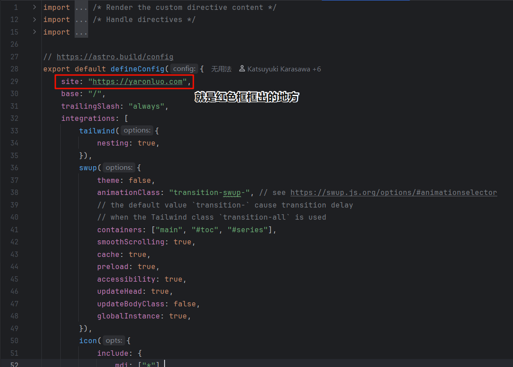

**至此你就已经学会了如何开始写自己的Blog文章**

## 5.本地预览，并且发布到Github上
打开powershell(如果有报错就用命令提示符)，输入`cd fuwari`进入fuwari文件夹

1. 当你的文章写的差不多的时候，想要预览一下，输入命令`pnpm dev`等待片刻，出现以下画面说明本地部署成功
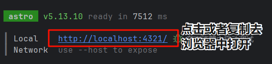
2. 预览文章发现无误之后，我们就需要把我们所做的更改使用Git发布到Github上了

   第一次推送可能需要Git知道你的身份，输入命令 `git config 你的Github用户名`和`git config 你注册的Github的邮箱`

   输入命令`git add .`添加所有更改
   
   输入命令`git commit -m "你的提交信息"`提交更改，其中**你的提交信息**可以更改
   
   输入命令`git push origin main`推送更改你的更改到Github，后续推送只需要输入`git push`即可

   如果显示下面画面就表示成功
   

## 6.让Cloudflare连接到Github，并且使用Pages服务托管你的Blog

> [!NOTE] 
> 接下来的教学默认你已经有了一个属于自己的域名
> 
> 如果没有请去[阿里云](https://cn.aliyun.com/)或者[腾讯云](https://cloud.tencent.com/)等域名提供商中购买，不建议买.cn后缀，因为要备案，购买教程自行搜索

1. 打开[Cloudflare](https://www.cloudflare.com/zh-cn/)官网，注册登录
2. 前往Cloudflare的Workers和Pages页面，创建一个新Pages
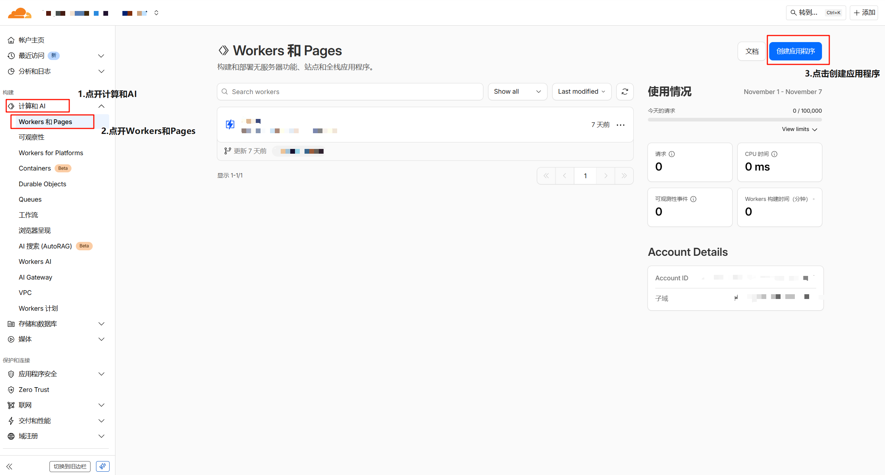
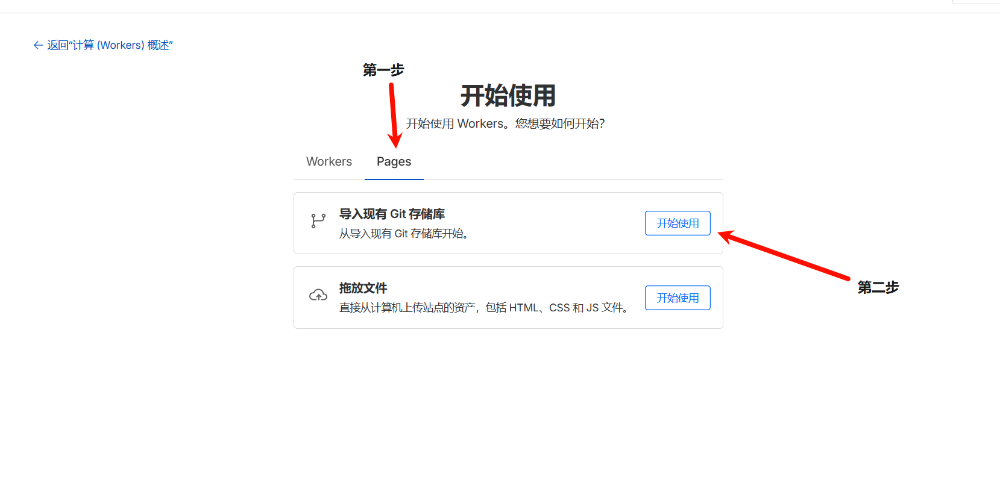
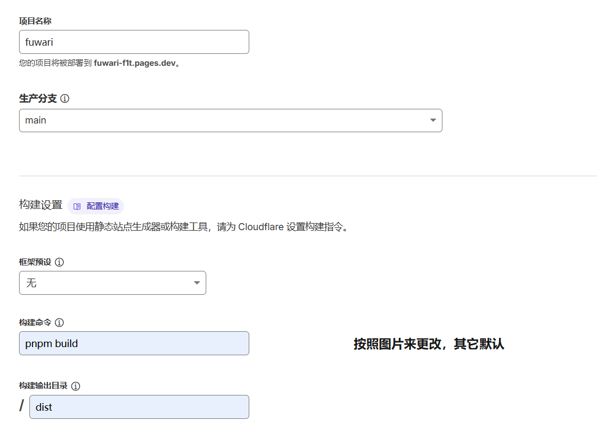
3. 设置自定义域
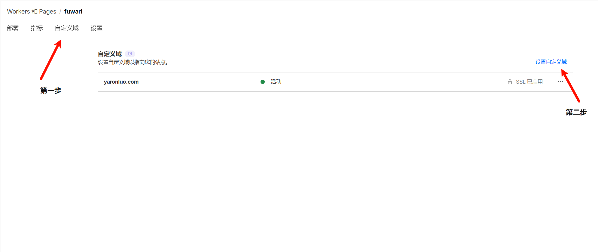
4. 随后，你只需要在本地编写文章，然后使用Git将更改推送到远程仓库，Cloudflare就会自动部署，更新你的博客

# 最后
相信你已经成功搭建好了自己的Blog，感谢你的浏览！我会继续分享更多技术教程的，如果看完这个文章你仍然不懂，或者我的文章有误，你可以通过社交媒体联系我

***今天就这样吧，希望下次你还在这里！***


