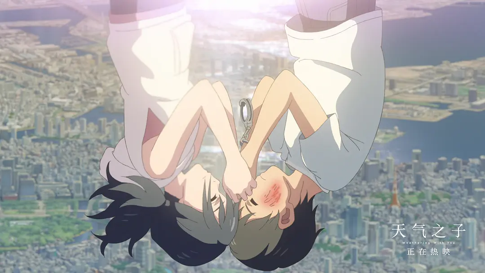
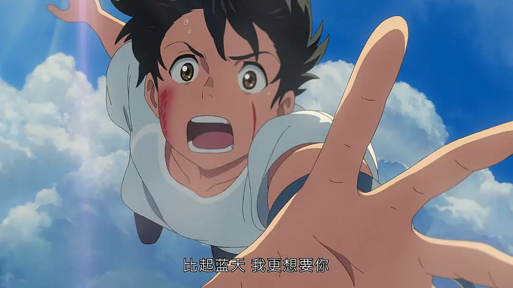
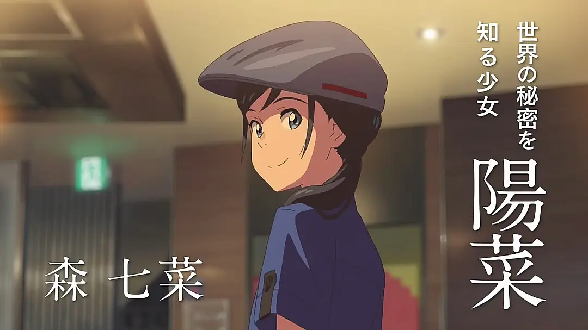
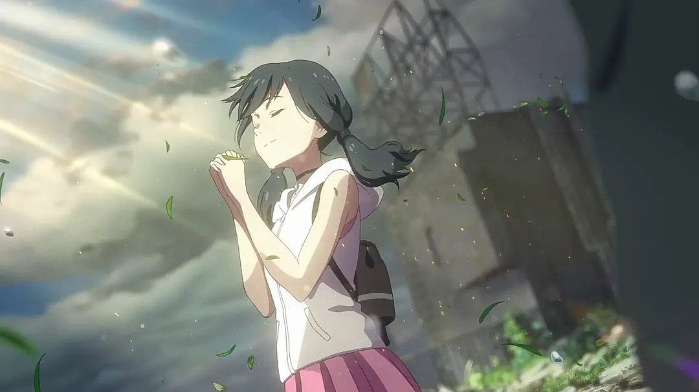
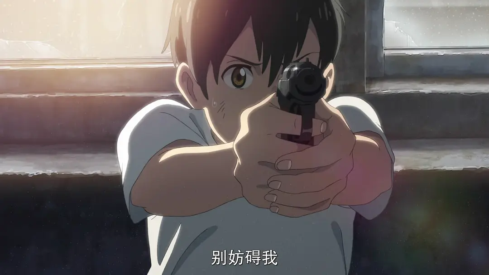
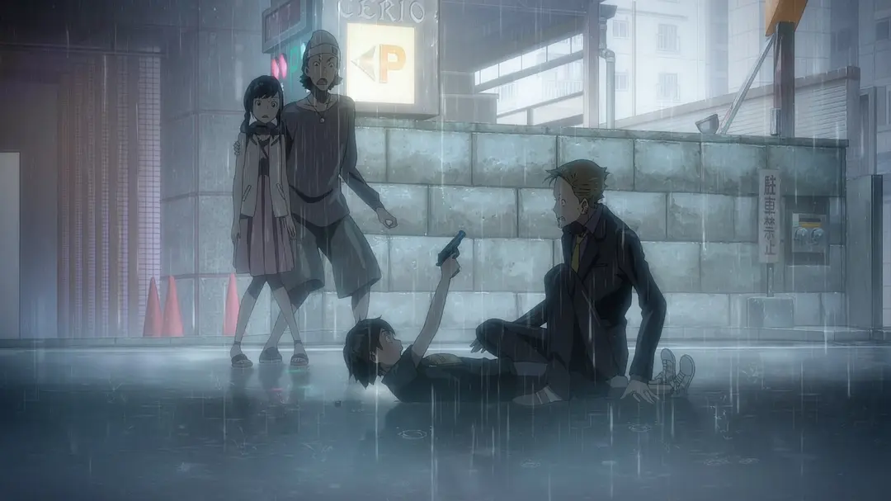
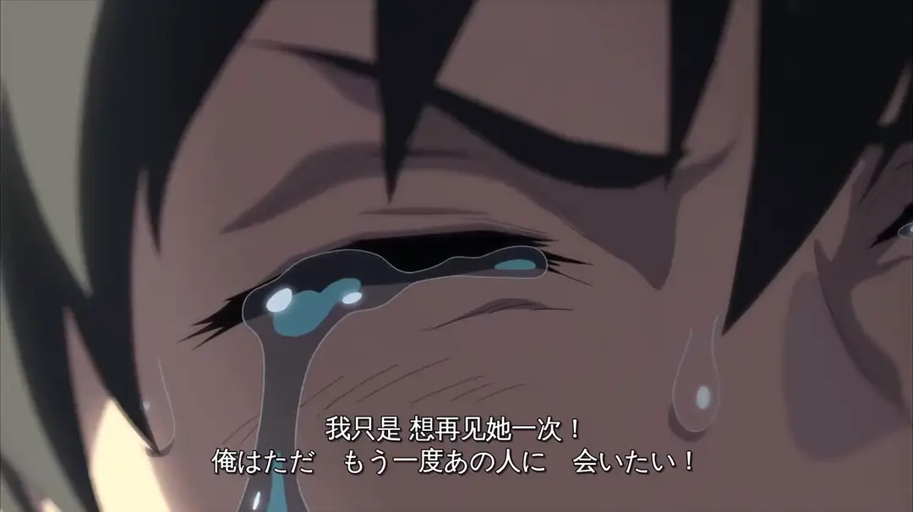
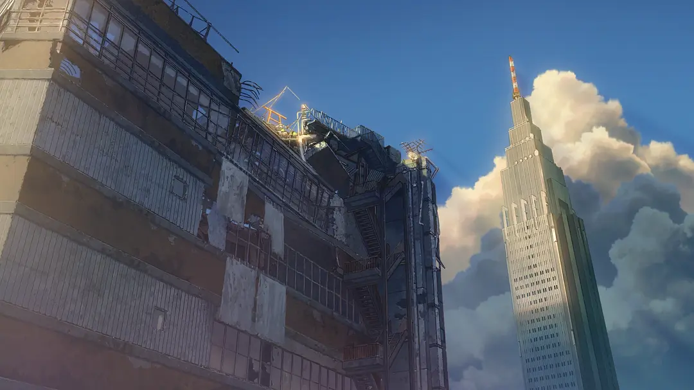
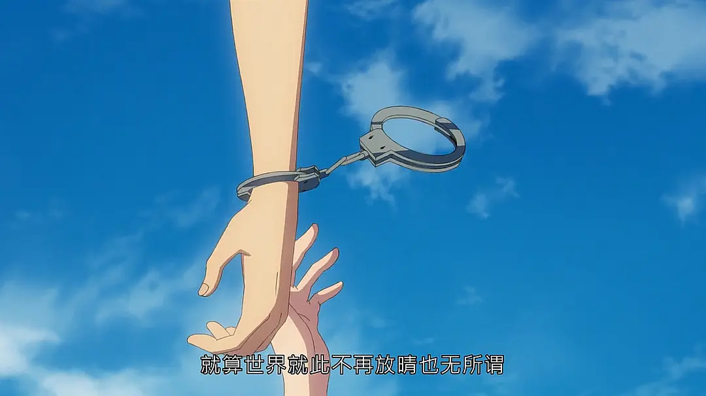
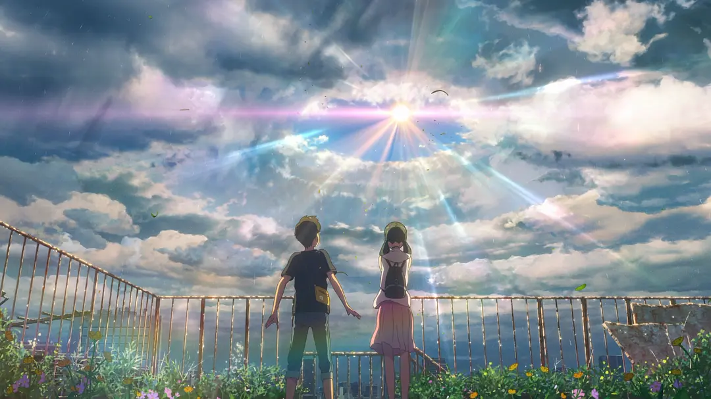

# 前言

2024年7月，《你的名字。》重映，我第一次在电影院完整看完一部真正意义上的日本动画电影。影片所传达的爱情观给当时的我带来了巨大的震撼，也让我第一次意识到，原来爱一个人可以如此美好、如此坚定。电影结束后，我在影院里久久无法释怀，直到现在，它依然是我心目中的“纯爱圣经”。

回到家后，我便开始深入了解新海诚的作品，并顺藤摸瓜地找到了这部于2019年上映的动画电影——《天气之子》。相信和许多人一样，当我看到豆瓣7.0分的评价时，也下意识地认为它远远不如《你的名字。》。第一次看完之后，这种印象反而更加深了：电影给我的感觉很普通，甚至有些失望。

然而，2026年的七夕节，我重新观看了这部已经上映七年的作品。这一次，我却从那些曾经忽略的细节中感受到了完全不同的东西，也终于明白，《天气之子》或许并不逊色于《你的名字。》，它只是用另一种更加尖锐、更加任性的方式，讲述了一段关于爱与选择的故事。

如果你愿意的话，可以点击播放按钮，配上这首来自《天气之子》的主题曲，继续阅读接下来的内容。**（注意音量哦！）**

  

    

      
    

    

      
    

    

  

  

    
 WEATHERING WITH YOU RECORD

    
愛にできることはまだあるかい

    
RADWIMPS · A-SIDE

    <audio controls preload="metadata" src="/music/ai-ni-dekiru-koto-wa-mada-arukai.mp3" aria-label="播放《愛にできることはまだあるかい》"></audio>
  

# 爱能做到的事情，还有什么？

“爱能做到的还有什么”是《愛にできることはまだあるかい》这首歌的中文名。看完《你的名字。》的我认为，爱能创造奇迹，爱能改变命运，爱能拯救糸守町，爱能让泷和三叶跨越时间与生死找到彼此。

但《天气之子》给出的答案并不是完美无暇的。爱没有让东京停止下雨，也没有让所有人获得幸福，它只是让一个少年在全世界都默认阳菜应该消失的时候，仍然选择不顾一切地奔向她。

《愛にできることはまだあるかい》的重点并不是赞美爱情无所不能。相反，它先承认了人的渺小：面对世界、命运和成年人制定的规则，两个十几岁的孩子几乎什么都没有。在电影前半段，爱似乎只是让人获得短暂的晴天；到了后半段，爱却变成了一种更加沉重的选择——当所有人都要求阳菜牺牲自己拯救世界时，帆高是否还愿意选择继续爱她，是否还愿意选择把她从所谓的命运中夺回来？

**如果爱不能阻止暴雨，不能改变规则，也不能让所有人获得幸福，那么爱能做到的事情，究竟还有什么？**

# 比起晴天，我更想要阳菜

**帆高来到东京时：**

- 他独自离开家乡；
- 身上没有多少钱；
- 找不到住处，也没有人愿意收留他；
- 在这座繁华的城市里，没有属于他的落脚处。

**阳菜的生活也没有表面上那么美好。母亲去世后：**

- 她独自照顾弟弟；
- 她很早就开始承担生活的压力；
- 她总是习惯照顾别人，却很少有人真正关心她；
- 她拥有带来晴天的能力，自己的生活却一直笼罩在阴雨中。

在别人看来，阳菜是“天气之子”，是“晴女”；但对帆高来说，她首先不是能够改变天气的晴女，而是那个在他饿着肚子时，愿意递给他一份食物的女孩。

**对东京而言，晴天比阳菜重要；**  
**对帆高而言，阳菜比晴天重要。**

# 她为所有人带来晴天，却没有人为她撑伞

所有的美好都是要付出代价的，天下没有免费的馅饼。阳菜使用能力的次数越多，身体就越接近天空，最终就会彻底从人间消失。

一开始，阳菜只是因为看到别人获得晴天时的笑容，才愿意继续使用自己的能力。那是她主动做出的选择，也是她第一次发现自己能够给别人带来幸福。

可后来，一切都变了。东京需要晴天，人们需要恢复正常的生活，于是阳菜的牺牲仿佛也成了一件理所当然的事情。

如果阳菜真心愿意为所有人牺牲，那是属于她的伟大；可当整个世界都默认她应该牺牲时，这份伟大就变成了一种残忍。她被称为晴女，被赋予神圣的使命，却也因此失去了作为普通女孩继续活下去的权利。

更何况，阳菜只是一个刚过完15岁生日的女孩。她的人生才刚刚开始，她不应该，也没有任何义务为了让别人幸福而牺牲掉自己的美好未来。

**世界看见的是一个能够换回晴天的祭品，只有帆高看见了那个还想活下去的阳菜。**

# 两次枪声：一个少年与世界为敌

## 第一次举枪：从伤害阳菜的人手中救下她

第一次发生在帆高发现阳菜被人强迫带走时。

那时他与阳菜认识不久，只记得这个女孩曾经给过自己一个汉堡，却仍然义无反顾地冲了上去。遭到殴打后，他在慌乱中掏出捡来的手枪并扣下扳机。

这一枪是冲动的，危险的，但是他只是一个少年，面对成年人的暴力，他没有身份，没有权力，也没有任何人可以求助，那把枪成为了他在绝境中唯一能够握住的反抗。

**第一次举枪，帆高保护的是阳菜的当下——不让她被眼前的人带走。**

## 第二次举枪：从整个世界手中夺回她

第二次是在阳菜消失之后。

帆高逃出警局，冒着暴雨回到废弃大楼。警察、成年人和现实的规则都挡在他的面前。他再次拿起那把曾经被自己丢弃的枪，只为了穿过楼顶的鸟居，再见阳菜一次。

这一次，站在帆高对面的已经不是一两个伤害阳菜的人，而是：

- 警察代表的社会秩序；
- 成年人要求他接受的现实；
- 晴女必须牺牲的古老规则；
- 默认阳菜消失才是正确答案的整个世界。

**第二次举枪，他保护的是——阳菜继续活下去的权利。**

和大多数人一样，我并不认为枪支与暴力值得浪漫化，反而认为这是不可取的。但是，帆高两次举枪也不是因为他想伤害谁，而是因为这个一无所有的少年，已经找不到任何一扇愿意为他打开的门。枪声表现的不是他的强大，而是他的无力与绝望。

**帆高曾经为了阳菜两次举枪面对世界。不是因为他天生勇敢，而是因为当世界决定牺牲阳菜时，他已经没有退路。**

# 没有阳菜的晴天，我不要

**东京终于拥有了所有人期待已久的晴天，帆高却在这片阳光下失去了自己最重要的人。**

对其他人来说，那一天的东京终于恢复了正常；但对帆高来说，那个没有阳菜的晴天，才是最不正常的世界。他明明知道，只要阳菜继续留在天空，东京就能恢复晴朗；也知道一旦将她带回来，大雨或许永远不会停止，可他还是选择握住了她的手。他无法接受一个所有人都认为合理的结局：阳菜牺牲自己，换来东京的晴天，然后所有人继续生活，仿佛她从未存在过。

**他不是为了毁掉世界才去找阳菜，而是因为阳菜本身就是他想要守护的世界。**

传统叙事里常见这样的逻辑：

- 为了大局，牺牲一个人；
- 为了拯救多数人，牺牲少数人；
- 被牺牲者被称作英雄；
- 活下来的人则获得平静的生活。

但是，这样的故事往往只强调牺牲的伟大，却很少关注被牺牲的人是否真的愿意。

当所有人都告诉阳菜“这是你的命运”时，这句话听起来像是在解释世界的规则，是为了拯救世界，但实际上却是在剥夺她拒绝的权利。她可以被赞美、被神化、被感恩，却不能拥有一个普通女孩想要继续生活下去的愿望。

这就是为什么重温《天气之子》的我有了重新的感悟，我不喜欢这种把牺牲包装成宿命的叙事。一个人愿意为别人牺牲，可以称为伟大；但如果所有人都默认她应该牺牲，那就不再是伟大，而是世界对一个善良之人的剥削。

# 爱没有拯救世界，但它救回了阳菜

爱并不是无所不能的。它不能让暴雨停止，不能恢复被淹没的东京，也不能让帆高的选择得到所有人的理解，更不一定能让所有人都获得幸福。

但爱仍然能做到很多事情：

- **爱能让人看见具体的人：** 世界看见的是“晴女”，帆高看见的是阳菜。
- **爱能让人拒绝不合理的命运：** 阳菜被告知应该牺牲，帆高却告诉她：**你不必因为别人需要晴天，就放弃自己的人生。**
- **爱能让人重新定义“世界”：** 爱没有拯救东京，却拯救了阳菜；爱没有让天气恢复正常，却让帆高和阳菜重新拥有了彼此；爱没有解决所有人的问题，却让一个人不必再独自面对命运。

所以我认为，《愛にできることはまだあるかい》真正想问的，也许不是爱能不能创造奇迹，而是在奇迹无法发生的时候，爱还愿不愿意坚持。当世界要求所爱的人牺牲时，仍然愿意站出来说：她不是祭品，她也有活下去的权利。

# 阳菜不欠世界一个晴天

这部电影刚上映的时候充满争议，一部分人认为帆高以牺牲整个世界为代价去拯救阳菜的行为很自私，很幼稚。  

我承认他们的选择带有自私，也承认东京为此付出了代价。阳菜回到人间以后，大雨重新降临，东京最终被海水淹没，无数普通人的生活因此改变。从结果来看，帆高确实为了一个自己所爱的人，放弃了整座城市期待已久的晴天。

## 拒绝牺牲一个人，不等于主动毁灭世界

东京的异常天气并不是帆高和阳菜制造的，电影最后暗示，东京原本就有大片区域属于海洋，帆高只是拒绝用阳菜的生命来阻止这场大雨。  

如果一个人拥有拯救所有人的能力，是否就意味着她必须为所有人而死？拥有这种能力，并不等于她欠整个世界一条命。阳菜能够换回晴天，是她拥有的力量；但这个世界没有资格因此把她的牺牲视作理所当然。  

我们不会因为牺牲一个无辜者能够挽救更多人，就认为那个无辜者有义务献出生命。同样，阳菜可以主动选择牺牲，但却不应该被所有人默认这是她的义务。

## 阳菜是一个人，不是解决天气问题的工具

网上很多人讨论这个结局时，总会提出一个问题：  

**用一个人来换一座城，值得吗？**

对旁观者来说，阳菜只是数百万人中的一个；对帆高和凪来说，她却是无法替代的全部。

当人们说“牺牲阳菜就能拯救东京”时，阳菜已经不再被当成一个会害怕、会痛苦、也渴望活下去的少女，而被简化成了恢复晴天的工具。

**如果帆高为了阳菜选择放弃东京是自私，那么整座东京为了获得晴天，要求一个少女永远消失，难道就不是另一种更庞大的自私吗？**

## 阳菜自愿牺牲，不代表其他人有权要求她牺牲

阳菜是自己选择成为晴女的。  

但这是因为：

- 她一直习惯照顾别人；
- 她认为自己的能力就是为了给别人带来幸福；
- 她面对的是“不牺牲自己，东京就继续下雨”的道德压力；
- 她几乎没有机会认真考虑自己是否也有权利活下去。

阳菜的牺牲确实出于她的善良，但善良不应该成为世界利用她的理由。一个人愿意牺牲自己，可以称为伟大；可其他人因为她足够善良，就默认她应该牺牲，那便不再是伟大，而是一种残忍。

**帆高真正带给阳菜的，不只是一次拯救，而是一个她此前从未拥有过的选择：你可以不再为所有人祈祷，也可以为了自己活下去。**

## 爱情和世界谁更重要

《天气之子》真正提出的问题，不是“为了爱情能不能毁灭世界”，而是“一个看似正常的世界，是否可以建立在无辜者的牺牲之上”。

如果这个世界只能依靠阳菜的死亡才能维持晴朗，那么帆高反抗的不只是天气，而是一条残酷的规则：**多数人的幸福，可以理所当然地压过少数人的生命。**

他没有接受多数人眼中最理性的选择，而是作出了一个最有人性的选择：她不是天气的祭品，她只是一个应该继续活下去的女孩。

# 最後に、一番伝えたいこと

如果帆高选择阳菜是一种自私，那么我愿意承认，有些自私并不值得羞愧。因为真正的爱，不是看着所爱之人走向牺牲，再告诉自己这是为了世界；而是在世界决定放弃她时，仍然愿意站在她的身边。

**世界想要晴天，而帆高只想要阳菜。至于我，我也会选择阳菜。**

***今天就这样吧，希望下次你还在这里！***
