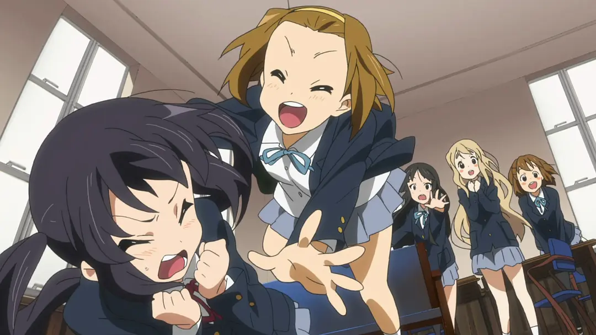
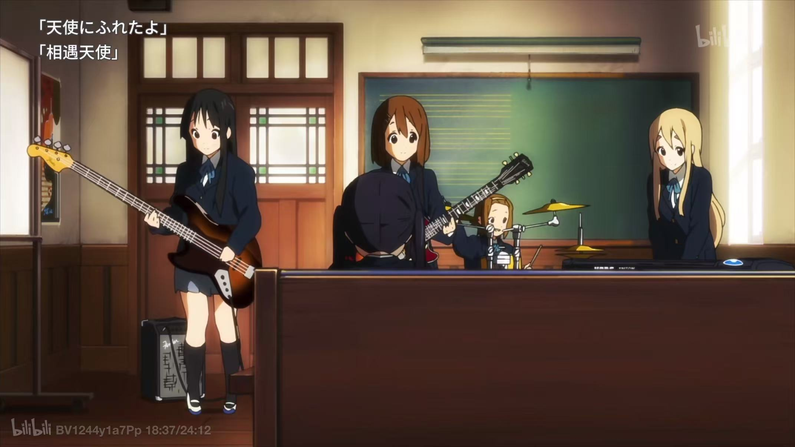
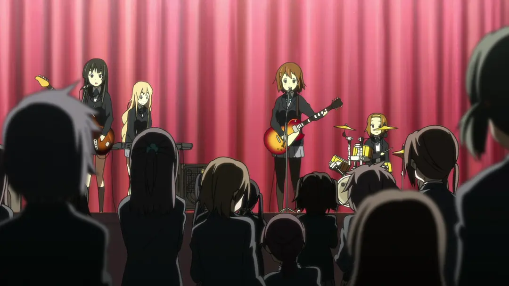
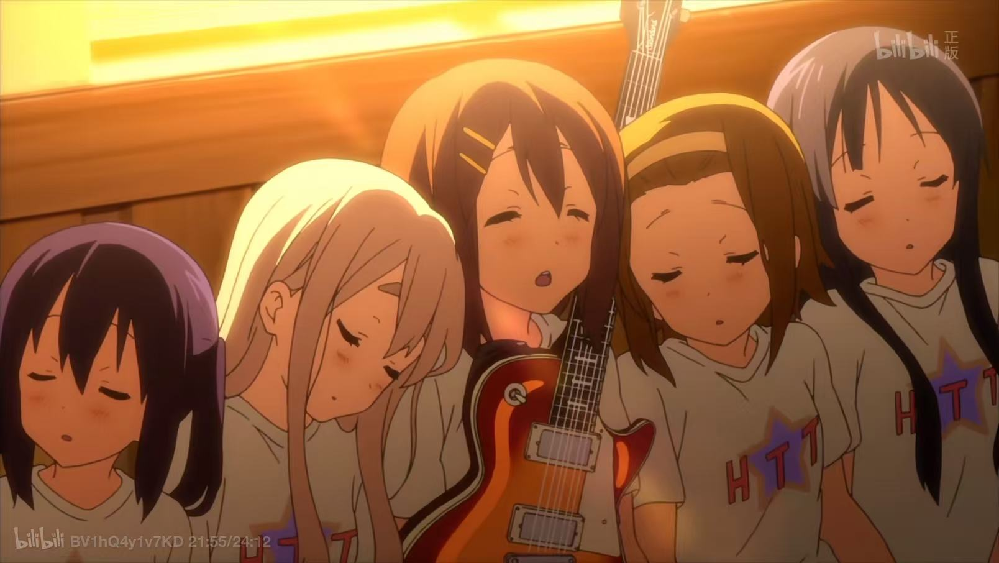

# 前言
六月给博客做界面大改造的时候，我在小红书上无意间淘到了现在的这张博客头像，当时的我甚至还不知道她是哪位角色，单纯觉得画面里的女孩子长得极其好看，后来在朋友的提醒下。我才知道她叫平泽唯，也顺藤摸瓜地打开了《轻音少女》这部番。  
作为一个平时只爱看纯爱番的人，点开这部番剧纯粹是因为它名气大，加上对平泽唯的好奇，经过一个多月的追番，这部原本只是我用来打发时间的日常番，却给我带来了后劲十足的情感冲击。  
**神啊~请给我一个新的大脑让我再以第一次的心态重看一次《轻音少女》吧！**  
如果你愿意的话可以点击播放按钮，配上一个背景音乐。(**注意音量哦！**)

  

    

      
    

    

      
    

    

  

  

    
 HTT MINI RECORD PLAYER

    
天使にふれたよ!

    
放課後ティータイム · A-SIDE

    <audio controls preload="metadata" src="/music/tenshi-ni-fureta-yo.mp3" aria-label="播放《天使にふれたよ!》"></audio>
  

# 从平泽唯开始的相遇(世界奇奇怪怪，呆唯可可爱爱)

番剧第一个出现的女主就是平泽唯，她是拥有绝对音感的天然呆，也是轻音部的团宠。栗色短发、黄色发卡，再加上笨拙却极具天赋的性格，共同构成了这位“天才型少女”。她对自己的吉他爱得直白又可爱，不仅给它取名为“吉太”，还把它当作伙伴一样照顾。  
**轻音部的“凝聚力核心”**  
唯虽然大多数时候看起来是最不靠谱的那个，但她那毫无保留的真诚、温暖与赤子之心，却是连接整个“放学后 Tea Time”的纽带。正是因为有她在，社团活动室里才总是充满了欢声笑语和茶香。  
**从迷茫到热爱的转变**  
刚进入高中时，她是个“想做点什么却不知道该做什么”的迷茫少女。但自从遇到了轻音部、遇到了大家，她找到了自己愿意倾尽全力的热爱。  
我最喜欢小唯的一句话：  
**“如果能遇到刚进高中时的我，真想告诉她：‘不用迷茫哦，在那里，有超级快乐的事情在等着你呢！’”**

# 那些看似什么都没有发生的日子
《轻音少女》整部番没有按照传统音乐番的剧情来走，她们本应该承载着更大的乐队梦想——去更大的舞台，去征服全国听众。但是《轻音少女》却不是这样的，它把极大量的篇幅，毫不吝啬地留给了那些“无意义”的瞬间：去唯家里吃冰淇淋、讨论合宿买什么零食、抢草莓蛋糕上的那一颗草莓、甚至只是在社团教室里给阿梓喵戴上猫耳。

《轻音少女》最特别的地方，是它几乎从不刻意提醒观众“时间正在流逝”。第一年的新生入部、第二年的校园祭、第三年的毕业旅行，这些故事都在轻松的笑声中悄悄过去。

我们总以为明天还能继续坐在活动室里喝茶，总以为下一次演出依然会有所有人到场。可当毕业真正到来的时候才发现，那些曾经觉得理所当然的日子，早已经成为无法回到的过去。

或许青春本来就是这样。身处其中时，我们只觉得每一天都很普通，等到它即将结束，才意识到那些普通的下午有多么珍贵。

# “请不要毕业”
如果《轻音少女》只有前半段的无忧无虑，它或许只会是一部优秀的日常搞笑番。但正是第二季后半段隐隐铺陈的“离别感”，才让这部作品升华为无数人心中的神作。在毕业真正到来以前，中野梓一直努力表现得很平静，但当毕业典礼结束后，分别终于来到眼前时，一直装作坚强理智的中野梓，还是忍不住地说出了那句：“`请不要毕业`。”

那一刻，所有的克制化为乌有。而四位学姐给予阿梓喵的回应，不是苍白的安慰，而是一首倾尽全力的专属歌曲——《天使にふれたよ!》（相遇天使），这也是全剧最催泪的高潮，同时也是我最喜欢的一首歌！(文章开头可以播放这首歌)

- **日文原词：**  
でもね、会えたよ！すてきな天使に  
卒業は終わりじゃない  
これからも仲間だから  
写真のわたしたちと同じ笑顔で  
ずっと ずっと ずっと一緒だよ
- **中文翻译：**  
但是呢，我遇到了哦！遇到了一位美好的天使  
毕业并不是终点  
以后我们也依然是伙伴  
会像照片上的我们一样带着同样的笑容  
永远 永远 永远在一起

这一刻打动我的，并不只是轻音社成员即将分别，而是我们都曾有过类似的愿望。我们明明知道时间不会因为任何人停下，却还是希望某个夏天可以再长一点，希望在某次放学之后，熟悉的人依然能够坐在原来的位置上。

# ふわふわ時間 -> 天使にふれたよ!
如果把《轻音少女》的两季动画比作一首长诗，那么它的前半段是《ふわふわ時間》（轻飘飘时光），而后半段的终章，则是《天使にふれたよ!》（相遇天使）。这两首歌，恰好构成了轻音部最动人的情感轨迹：**从“无忧无虑的相聚”，走向“温柔坚定的告别”。**

## 🍵《ふわふわ時間》：那些被奶油与红茶浸润的轻飘飘岁月
《轻飘飘时间》是轻音社的第一首原创歌曲，首次出现在第一季的第一次学园祭，**“流水的轻音社，铁打的滑滑蛋！”**，这首歌在之后的剧情中一直反复出现，可以说，这首歌贯穿了轻音部一路走来的时光。

在剧集的前半程，《ふわふわ時間》是属于“放学后 Tea Time”的灵魂之曲。这首歌的旋律轻快、歌词甚至带有一点无厘头的少女娇嗔。它记录着她们最真实的社团日常——没有宏大的抱负，没有苦大仇深的训练，有的只是在音乐教室里吃着琴吹紬带来的草莓蛋糕、喝着热气腾腾的红茶、讨论着下课后去哪里买零食。
<iframe frameborder="no" border="0" marginwidth="0" marginheight="0" width=800 height=80 src="https://i.y.qq.com/n2/m/outchain/player/index.html?songid=257954571&songtype=0
"></iframe>
那时候的她们，以为夏天永远不会结束，以为放学后的茶会可以一直喝下去。这种“轻飘飘”的空气感，是青春里最奢侈的无所事事。

## 🌸《天使にふれたよ!》：用尽全力的克制，书写最温柔的答卷
然而，时间从不为任何人停下脚步。到了第二季的第 24 集，当毕业典礼结束，曾经最怕麻烦、连吉他都不懂得怎么买的平泽唯，却悄悄和大家(秋山澪、田井中律、琴吹紬)一起，为留在社团的唯一后辈阿梓喵写下了这首专属的《天使にふれたよ!》。

这是整部动画最催泪的时刻。面对终于忍不住落泪、说出“请不要毕业”的阿梓喵，学姐们没有跟着大哭，也没有给出苍白的承诺。她们只是拿起乐器，相视一笑，把所有的宠溺、不舍与感恩，全部融进了琴弦与歌声里。

从《ふわふわ時間》里的轻飘飘与漫不经心，到《天使にふれたよ!》里的坚定与深情，她们完成了从“被照顾的女孩”到“能够带给他人力量的学姐”的成长。

最深的伤感，从来不需要用嚎啕大哭来表达。京阿尼用最轻柔的旋律，唱出了全剧最重的一句告白：**放学后 Tea Time 永远不会散场，因为你就是我们遇到的天使。**

# 放学后 Tea Time：轻音社永不毕业！
番剧的最后，唯，澪，律和紬毕业了，梓留在了轻音部，准备与忧和纯一起迎接新的生活。轻音部的活动室里，依然会飘出红茶的香气，但独属于那五个人的“放学后 Tea Time”终究还是画上了句号。

看完《轻音少女》的时候，我已经十八岁了，高中毕业刚好一年多了。以前总觉得十八岁代表着自由和新的开始，可真正走到十八岁时才明白，成长不只是获得更多选择，也意味着我们必须不断与过去告别。

有些朋友会走向不同的城市，有些以前每天都能见到的人，未来可能只能偶尔在聊天框里问候，我们不会像动画一样拥有永远不会变化的活动室，也不会永远停留在那个放学后的下午。

但《轻音少女》让我明白，分别并不会否定过去的意义。正因为一段时光无法永远持续，它才值得被认真珍惜。

# 那间活动室里，藏着我最向往的青春
我一直以为，我向往的是：
- 平泽唯天赋异禀的绝对音感；
- 秋山澪无可挑剔的琴艺与才华；
- 田井中律永不枯竭的元气与活力；
- 琴吹紬高不可攀的豪门家世；
- 中野梓远超同龄人的认真与演奏水平。

但直到看完整部番剧，我才后知后觉地明白，我真正向往的，其实是：
- 即使小唯总是只顾着贪吃、呆到连乐谱都看不懂，大家却依然愿意毫无保留地宠着她、包容她所有的冒失；
- 即使 Mio（澪）害羞内敛又胆小如鼠，身边也始终有一个从小一起长大的律，在她想要逃跑时一把拉住她，做她最坚实的后盾；
- 即使律大大咧咧、粗心大意还爱偷懒，但也总能得到 Mio 毫无保留的包容与偏爱，在她打闹嬉笑时有人宠溺地敲她的头；
- 即使紬拥有着人人羡慕的大小姐光环，但在活动室里，没有人在意她的身世与家产，大家都只是拉着她的手，陪她一起体验普通少女最平凡、最炽热的小生活；
- 即使梓喵是最晚加入的后辈，严谨固执得像个小大人，但四位学姐却甘愿把她宠成最特别的“天使”，在她面临告别时，倾尽全力为她唱响那一首独一无二的歌。

我羡慕的从来不是她们身上的光环，而是她们在那个温暖的活动室里，完全接纳了彼此不完美的灵魂，并把最炽热的偏爱与温柔，毫无保留地交给了对方，共同拥有了一段难忘而美好的青春！

**放課後ティータイムは、ずっと放課後です！**  
**“放学后 Tea Time，永远都是‘放学后’！”**

# 最後に、一番伝えたいこと
即使我们可能再也看不到《轻音少女》的第三季了，但我会一直把这片温柔的避风港留在心里，谢谢呆唯，谢谢 Mio，谢谢律队、紬酱和阿梓喵，谢谢你们带给我这场永不落幕的美梦。

***今天就这样吧，希望下次你还在这里！***
